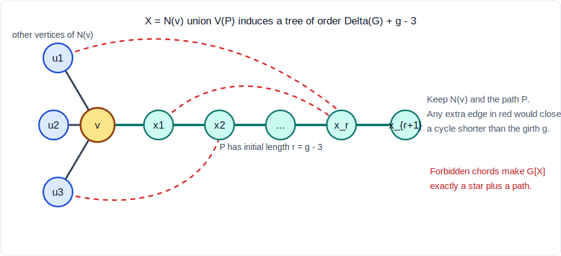

# Natural-Language Proof of the Strong Local-Girth Bound

Date: 2026-05-22

## Statement

Let `G` be a finite simple connected graph containing a cycle. Let `g` be its
girth, let

```text
l(v) = alpha(G[N(v)]),    L(G) = max_v l(v),
```

and let `tree(G)` be the maximum order of an induced tree in `G`.

Then

```text
tree(G) >= L(G) + max(1, g - 3).
```

This is sharp for complete graphs, complete bipartite graphs, and cycles.

## Proof

First note the basic star bound. For every vertex `v`, choose an independent set
`S` in `G[N(v)]` of size `l(v)`. Then `G[S union {v}]` is an induced star, hence
an induced tree on `l(v)+1` vertices. Therefore

```text
tree(G) >= L(G) + 1.
```

This proves the desired inequality when `g=3`, since `max(1,g-3)=1`.

Now assume `g >= 4`. Then `G` is triangle-free. Hence every neighborhood `N(v)`
is independent, and therefore

```text
l(v) = d(v),    L(G)=Delta(G).
```

Choose a vertex `v` of maximum degree. We claim that there is a simple path
starting at `v` of length at least `g-3`.

Indeed, let `C` be a shortest cycle of length `g`. Since `G` is connected, take
a shortest path from `v` to `C`, ending at a vertex `c` of `C`. This path meets
`C` only at `c`; otherwise it would not be a shortest path to the cycle. After
reaching `c`, traverse the cycle `C` in either direction for `g-1` edges, stopping
before returning to `c`. The concatenation is a simple path starting at `v` and
has length at least `g-1`, hence in particular at least `g-3`.

Let

```text
P = (v=x_0, x_1, ..., x_r)
```

be the initial segment of such a path of length

```text
r = g - 3.
```

Set

```text
X = N(v) union V(P).
```

Figure 1 shows the intended induced tree: all neighbors of `v` are attached at
`v`, while the path `P` supplies the extra `g-3` vertices. The dashed red edges
are exactly the possible extra edges that the girth assumption rules out.



We will show that `G[X]` is an induced tree.

First, `N(v)` and `V(P)` meet only at `x_1`. Certainly `x_1` is a neighbor of
`v`. If `x_i` were also a neighbor of `v` for some `i >= 2`, then the path

```text
v=x_0, x_1, ..., x_i
```

together with the edge `x_i v` would form a cycle of length `i+1`. Since
`i <= r = g-3`, this cycle would have length at most `g-2`, contradicting the
definition of girth. Thus

```text
|X| = |N(v)| + |V(P)| - 1 = d(v) + r = Delta(G) + g - 3.
```

The graph `G[X]` is connected because all vertices of `N(v)` are adjacent to
`v`, and all vertices of `P` lie on a path from `v`.

It remains to prove that no extra induced edges create a cycle. This is the
formal version of the dashed-edge exclusions in Figure 1.

1. There are no chords of `P`. If `x_i x_j` is an edge with `j >= i+2`, then
   the subpath from `x_i` to `x_j`, together with `x_i x_j`, forms a cycle of
   length `j-i+1 <= r+1 = g-2`, impossible.

2. There are no edges inside `N(v)`, because `G` is triangle-free.

3. Let `u` be a vertex of `N(v) \\ {x_1}`. Then `u` is not adjacent to `x_1`,
   again because `N(v)` is independent. If `u` were adjacent to `x_i` for some
   `i >= 2`, then the path

   ```text
   v=x_0, x_1, ..., x_i
   ```

   together with the edges `uv` and `ux_i` would form a cycle of length
   `i+2 <= r+2 = g-1`, again impossible.

So `G[X]` consists exactly of the path `P` with all other neighbors of `v`
attached as leaves at `v`, as in Figure 1. It is therefore an induced tree.
Its order is

```text
|X| = Delta(G) + g - 3 = L(G) + g - 3.
```

This proves the theorem for `g >= 4`, and the case `g=3` was already handled by
the star bound. Hence

```text
tree(G) >= L(G) + max(1, g - 3)
```

for every finite simple connected graph containing a cycle.

## Corollary: WOWII Conjecture 141

For every integer `g >= 3`,

```text
max(1, g-3) >= ceil(g/2) - 1.
```

Therefore the theorem implies

```text
tree(G) >= L(G) + ceil(g/2) - 1,
```

which is exactly the cyclic-domain ceiling form of Written on the Wall II
Conjecture 141.

## Sharpness

The additive term cannot be improved in general.

- For `K_n`, `g=3`, `L=1`, and `tree(K_n)=2`, so equality holds.
- For `K_{a,b}` with `a,b>=2`, `g=4`, `L=max(a,b)`, and the largest induced
  trees are stars of order `max(a,b)+1`, so equality holds.
- For `C_m` with `m>=5`, `g=m`, `L=2`, and `tree(C_m)=m-1`; the bound gives
  `2+m-3=m-1`, so equality holds.
