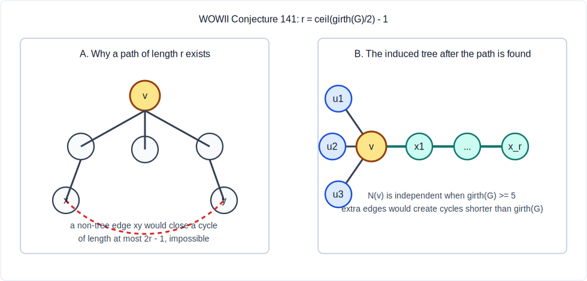

# WOWII Conjecture 141 Strong Version

## Statement

Let `G` be a finite simple connected graph. Let

- `tree(G)` be the number of vertices in a largest induced tree of `G`;
- `girth(G)` be the length of a shortest cycle, with value `0` for acyclic graphs;
- `l(v)` be the independence number of the subgraph induced by the neighbors of `v`.

Then

```text
tree(G) >= ceil(girth(G) / 2) - 1 + max_v l(v).
```

In Lean/Nat arithmetic this is represented as

```lean
(G.girth + 1) / 2 - 1 + Finset.univ.sup (indepNeighborsCard G) <=
  largestInducedTreeSize G
```

because `(g + 1) / 2` is `ceil(g / 2)` for natural numbers.

## Proof

If `G` is acyclic, then `G` itself is an induced tree. Hence
`tree(G) = |V(G)|`. Also `girth(G) = 0`, so the left side reduces to
`max_v l(v)`, and every neighbor-independent set has at most `|V(G)|`
vertices. The result follows.

Assume now that `G` contains a cycle.

First, for every vertex `v`, the set consisting of `v` together with a
maximum independent subset of its neighbor set induces a star. Therefore

```text
l(v) + 1 <= tree(G).
```

This already proves the theorem when `ceil(girth(G) / 2) - 1 <= 1`.

It remains to handle the case

```text
r := ceil(girth(G) / 2) - 1 >= 2.
```

Then `girth(G) >= 5`, so `G` is triangle-free. Consequently, for every
vertex `v`, its whole neighbor set is independent, and `l(v) = deg(v)`.

Fix a vertex `v`. We prove that `G` has an induced tree with at least
`deg(v) + r` vertices.

Figure 1 summarizes the two structural moves in the proof. Panel A is the
spanning-tree contradiction that forces a path of length at least `r` from
`v`. Panel B is the resulting induced tree on `N(v) union V(P)`.



Choose a spanning tree `T` of `G`. We first claim that in `T` there is a
path starting at `v` of length at least `r`. Otherwise all vertices of `T`
would have distance less than `r` from `v`. Since `G` is not acyclic, there
is an edge `xy` of `G` that is not an edge of `T`. The unique `x-y` path in
`T`, together with `xy`, forms a cycle in `G`. The distance bound gives

```text
dist_T(x, y) <= (r - 1) + (r - 1),
```

so this cycle has length at most `2r - 1`. But for
`r = ceil(girth(G) / 2) - 1`, one has `2r - 1 < girth(G)`, contradicting
the definition of girth. Thus such a path exists.

Let `P` be the first `r` edges of such a path from `v`. Consider the vertex
set

```text
N(v) union V(P).
```

The path starts at `v`, and its first non-root vertex is the unique member
of `N(v) cap V(P)`. If another path vertex at distance `i >= 2` from `v`
were adjacent to `v`, it would form a cycle of length `i + 1 <= r + 1`,
which is less than `girth(G)`. Thus the intersection has size one, and the
set has exactly

```text
deg(v) + (r + 1) - 1 = deg(v) + r
```

vertices.

The induced subgraph on this set is connected: every neighbor of `v` is
adjacent to `v`, and every path vertex is connected to `v` along `P`.

It is also acyclic. This is the dashed-edge exclusion shown in Panel B of
Figure 1. A cycle contained entirely in `P` would have length at
most `r + 1 < girth(G)`. A cycle using a neighbor of `v` off the path would
need to leave that neighbor through an edge other than the edge to `v`.
It cannot go to another neighbor of `v`, since `G` is triangle-free and
`N(v)` is independent. It also cannot go to a non-root path vertex at
distance `i`, because that would create a cycle through `v` of length
`i + 2 <= r + 2 < girth(G)`. Hence every such off-path neighbor is a leaf,
and no cycle can pass through it.

Therefore the induced subgraph on `N(v) union V(P)` is the tree depicted in
Panel B of Figure 1, with at least `deg(v) + r = l(v) + r` vertices.

Taking `v` with maximum `l(v)` gives

```text
tree(G) >= ceil(girth(G) / 2) - 1 + max_v l(v).
```

## Formalization

The Lean proof is in:

```text
artifacts/lean_workspaces/conjecture141_strong/FormalConjectures/WrittenOnTheWallII/GraphConjecture141.lean
```

The compiled theorem is named `conjecture141_strong`.
