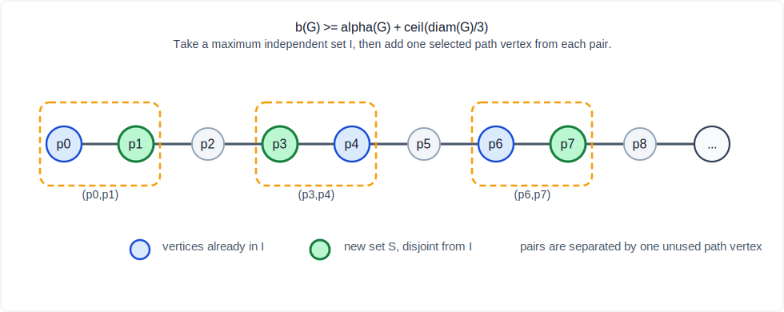

# Natural-Language Proof of WOWII Conjecture 17

## Statement

Let `G` be a finite simple connected graph. Let `b(G)` be the maximum order of
an induced bipartite subgraph, let `alpha(G)` be the independence number, and
let `diam(G)` be the diameter. The proved bound is

```text
b(G) >= alpha(G) + ceil(diam(G) / 3).
```

## Proof

Choose a maximum independent set `I`, so `|I| = alpha(G)`. Also choose a
diameter geodesic

```text
P = p_0, p_1, ..., p_D,
```

where `D = diam(G)`. Since `P` is geodesic, it is an induced path: a chord
between `p_i` and `p_j` with `i+1 < j` would shorten the walk.

Figure 1 shows the selection step. For every

```text
j < (D + 2) / 3,
```

look at the adjacent pair

```text
(p_{3j}, p_{3j+1}).
```

The independent set `I` cannot contain both vertices of this pair. Therefore at
least one of the two vertices is outside `I`; put one such vertex into a new set
`S`.



The selected vertices are distinct because the pairs occur in disjoint blocks
along the path. Moreover, two selected vertices cannot be adjacent. Indeed,
vertices selected from different pairs are separated on the path by at least
one unused intermediate path vertex, and any shortcut edge between them would
contradict the geodesic property of `P`.

Thus `S` is independent, `S` is disjoint from `I`, and

```text
|S| = ceil(D / 3).
```

The induced subgraph on `I union S` is bipartite, because both `I` and `S` are
independent sets. Therefore

```text
b(G) >= |I union S|
     = alpha(G) + ceil(diam(G) / 3).
```

This is the natural-number statement formalized as

```text
G.indepNum + (G.diam + 2) / 3 <= largestInducedBipartiteSubgraphSize G,
```

and the Lean file then converts `(G.diam + 2) / 3` to the real-valued ceiling
form `ceil(diam(G) / 3)`.
