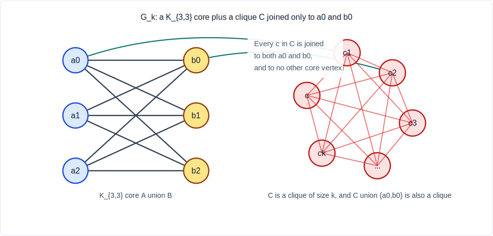
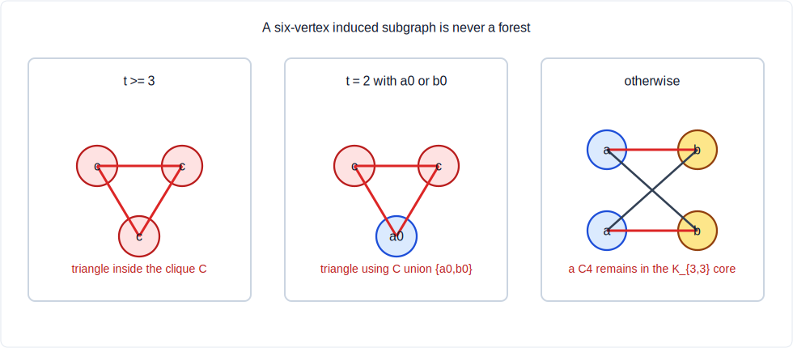

# Counterexample to WOWII GraphConjecture58

Status: counterexample.

## Construction

Let `k = 55`. Define a graph `G_k` with vertex set:

```text
A = {a0, a1, a2}
B = {b0, b1, b2}
C = {c1, ..., ck}
```

Edges:

1. All edges between `A` and `B`; this is a `K_{3,3}` core.
2. All edges inside `C`; this makes `C` a clique.
3. For each `c in C`, add edges `c-a0` and `c-b0`.
4. No other edges.

Equivalently, `C union {a0,b0}` is a clique attached to the edge `a0-b0` of
the `K_{3,3}` core.

Figure 1 shows the construction. The left side is the `K_{3,3}` core, and the
right side is the clique `C`; the only edges from `C` to the core go through
`a0` and `b0`.



The graph is connected and has:

```text
n = |V| = 6 + k = 61.
```

## Largest Induced Bipartite Subgraph

The core `A union B` induces `K_{3,3}`, so:

```text
b(G_k) >= 6.
```

Also, as Figure 1 emphasizes, `C union {a0,b0}` is a clique of size `k+2`.
Any induced bipartite
subgraph can contain at most two vertices from this clique. Outside this clique
there are only four vertices:

```text
{a1,a2,b1,b2}.
```

Therefore any induced bipartite subgraph has at most:

```text
2 + 4 = 6
```

vertices. Hence:

```text
b(G_k) = 6.
```

This upper bound is sharp in several ways: `A union B` has size `6`, and so do
sets such as `{a0,a1,a2,b1,b2,c1}`.

## Largest Induced Forest

There is an induced forest with 5 vertices:

```text
{c1, a0, a1, a2, b1}.
```

It induces a tree: `b1` is adjacent to all three `a` vertices, and `c1` is
adjacent only to `a0` inside this set.

So:

```text
f(G_k) >= 5.
```

Now prove no induced forest has 6 vertices.

Let `S` be a 6-vertex set, and let `t = |S cap C|`.

The case split below is illustrated in Figure 2. In each case, the selected
six vertices contain either a triangle inside the clique side or a `C4` inside
the `K_{3,3}` core.



- If `t >= 3`, then `S` contains a triangle inside the clique `C`.
- If `t = 2`, then the two vertices from `C` are adjacent. If `S` also contains
  `a0` or `b0`, there is a triangle. If it contains neither `a0` nor `b0`, then
  the other four vertices must be `a1,a2,b1,b2`, which induce a `C4`.
- If `t = 1`, then `S` contains five core vertices. If those five include both
  `a0` and `b0`, then the vertex from `C` forms a triangle with them. If not,
  the five core vertices induce either `K_{2,3}` or `K_{3,2}`, both of which
  contain a `C4`.
- If `t = 0`, then `S` is the whole `K_{3,3}` core, which contains a `C4`.

Thus every induced 6-vertex set contains either a triangle or a `C4`, exactly
as summarized in Figure 2, and so is not acyclic. Hence:

```text
f(G_k) = 5.
```

## Local Neighborhood Independence Values

For each of the six core vertices, `l(v)=3`.

Example: for `a0`, its neighborhood is:

```text
B union C.
```

The set `B` is independent of size `3`. No independent set can have size `4`:
`C` is a clique, every `c in C` is adjacent to `b0`, and the largest choice is
either all of `B` or `{b1,b2,c}`. The same argument applies to `b0`; for
`a1,a2,b1,b2`, the neighborhood inside the opposite core side is simply an
independent set of size `3`.

For each `c in C`, its neighborhood is:

```text
(C \ {c}) union {a0,b0}.
```

This is a clique, since `C` is a clique and `a0-b0` is an edge and both are
adjacent to all vertices of `C`. Hence:

```text
l(c) = 1.
```

Therefore:

```text
sum_v l(v) = 6*3 + k*1 = 18 + k.
```

For `k=55`:

```text
L = 73
n = 61
l_avg = 73/61.
```

## Failure of Conjecture58

The formal left side is:

```text
ceil(b / l_avg)
  = ceil(6 / (73/61))
  = ceil(366/73).
```

Since:

```text
5 < 366/73 < 6,
```

we have:

```text
ceil(366/73) = 6.
```

But:

```text
largestInducedForestSize(G_k) = 5.
```

So the claimed inequality:

```text
ceil(b / l_avg) <= largestInducedForestSize
```

becomes:

```text
6 <= 5,
```

which is false.

Thus the current formal statement of WOWII GraphConjecture58 is false.

## Infinite Family

For this family:

```text
n = 6+k
b = 6
f = 5
L = 18+k
l_avg = (18+k)/(6+k).
```

The conjecture fails exactly when:

```text
6 / l_avg > 5
```

equivalently:

```text
6(6+k) > 5(18+k)
k > 54.
```

So every `k >= 55` gives a counterexample.
